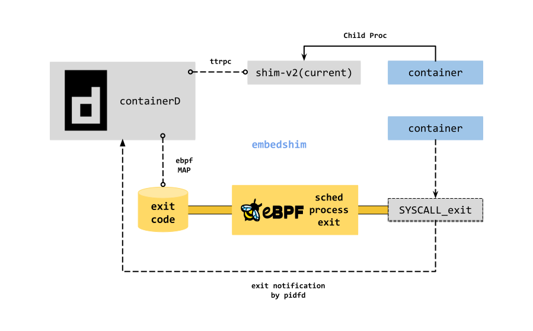

# embedshim

The embedshim is the kind of task runtime implementation, which can be used as
plugin in containerd.

With current shim design, it is used to manage the lifecycle of container
process and allow to be reconnected after containerd restart. The one of the
key design elements of a small shim is to be a container process monitoring,
at least it is important to containerd created by runC-like runtime.

Without pidfd and ebpf trace point feature, it is unlikely to receive exit
notification in time and receive exit code correctly as non-parents after shim
dies. And in kubernetes infra, even if the containers in pod can share one
shim, the VmRSS of shim(Go Runtime) is still about 8MB.

So, this plugin aims to provide task runtime implementation with pidfd and
eBPF sched_process_exit tracepoint to manage deamonless container with
low overhead.



[](https://asciinema.org/a/480970)

## Build/Install

The embedshim needs to compile bpf with clang/llvm. So install clang/llvm as first.

```bash
$ echo "deb http://apt.llvm.org/focal/ llvm-toolchain-focal main" | sudo tee -a /etc/apt/sources.lis
$ wget -O - https://apt.llvm.org/llvm-snapshot.gpg.key | sudo apt-key add -
$ sudo apt-get update -y
$ sudo apt-get install -y g++ libelf-dev clang lld llvm
```

And then pull the repo and build it.

```bash
$ git clone https://github.com/fuweid/embedshim.git
$ cd embedshim
$ git submodule update --init --recursive
$ make
```

The binary is named by `embedshim-containerd` which has full functionality in
linux. You can just replace your local containerd with it.

```bash
$ sudo install bin/embedshim-containerd $(command -v containerd)
$ sudo systemctl restart containerd
```

And check plugin with `ctr`

```bash
$ ctr plugin ls | grep embed
io.containerd.runtime.v1        embed                    linux/amd64    ok
```

## Status

The embedshim supports to run container in headless or with input.
But it still works in progress, do not use in production.

* [ ] Support Exec
* [ ] Support Pause/Resume
* [ ] Metrics Support
* [ ] Task Event(Create/Start/Exit/Delete/OOM) support

## Requirements

* raw tracepoint bpf >= kernel v4.18
* CO-RE BTF vmlinux support >= kernel v5.4
* pidfd polling >= kernel v5.3
